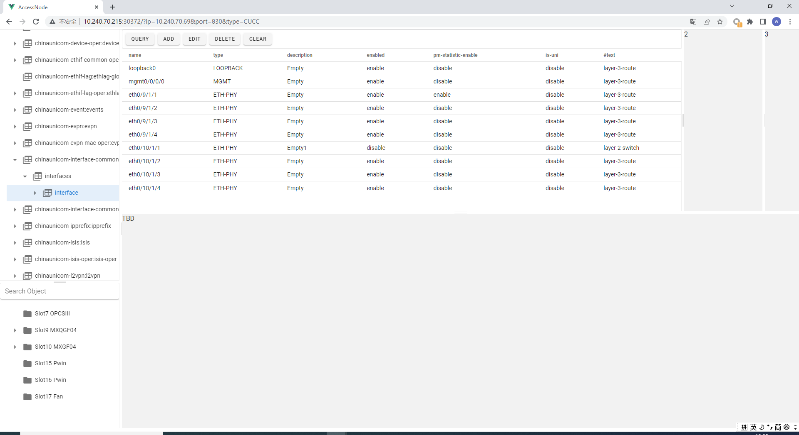

This project is used to access node by netconf.   
It adopts the native yang tree structure of the device as the access function tree, this UI operation style is like the netconf browser that user can access the configuration easily.   
The source code includes frontend UI which is implemented by vue/vurtify, and the backend code which is written by python.   

url sample to access node: 
http://10.240.70.215:30372/?ip=10.240.70.111&port=811&type=CUCC

UI sample:

